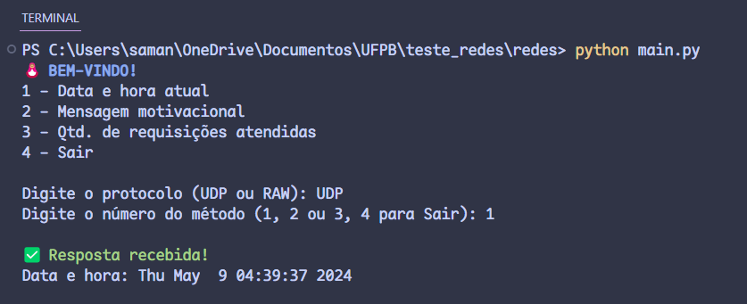

# Implementação de Sockets UDP e RAW

O seguinte repositório contém o projeto final da disciplina de Redes de Computadores.

> Implementado por Chirstopher, Enthony e Samantha.

## Dependências e execução

O projeto foi desenvolvido em Python 3.10.x.

Antes de executar o código principal, por favor baixe as seguintes dependências:

```bash
pip install termcolor # versão 2.4.0
```

Feito isso, execute o comando abaixo na pasta raiz do projeto.

```bash
python main.py
```

> Considerações: em caso de execuções via IDE ou terminal, lembre-se de executar no modo de administrador.

Agora o usuário pode informar um nome d protocolo implementado no terminal e solicitar uma das 3 opções de requisição.



Todas as informações necessárias sobre o desenvolvimento estão comentadas ao longo do código.

### Considerações sobre o desenvolimento

- O código poderia incluir a limpeza de tela
- Realizar mais limpeza do código
  > Por exemplo, ambas as implementação poderiam fazer uso de uma classe ou método do arquivo `utils.py` para reaproveitar a estrutura de exibição de mensagens.
  > Um outro exemplo seria criar uma classe separada para realizar ações em comum na formatação e parse das requests/response, mas aí teria que passar o tipo de protocolo junto e daria um trabalhinho extra.
